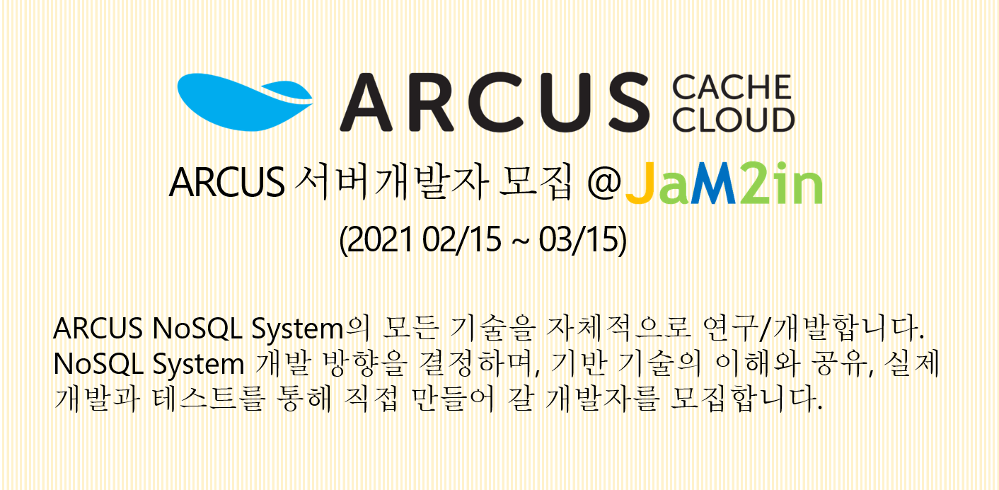

</img>

[ARCUS(Memory Cache Cluster)](http://naver.github.io/arcus/)를 개발하는
[잼투인(주)](http://www.jam2in.com/)에서 **ARCUS 서버 개발자**를 채용합니다.
    

## 담당업무

> - ARCUS Cache를 다양한 응용들에서 활용되게 하는 다양한 기능이나 기술을 개발합니다.
> - ARCUS Cache의 문제점과 최적화 요소를 찾아 개선하여 시스템 완성도를 높여나갑니다.

## 자격요건

> - 신입/경력 7년 이하
> - 컴퓨터 공학 또는 관련 계열 전공 (기졸업자 또는 졸업예정자)
> - Linux 환경에서 C Programming 개발 능력
> - OOP(Object-Oriented-Programming) 이해도와 개발 경험
> - 전반적인 Computer Science 기술 이해와 관련 아이디어 구현 경험
> - Data Structure, Basic Algorithm(Sorting, Search, Optimize ..) 이해와 구현 경험
> - 소프트웨어 개발 펀더멘탈(설계, 개발, 테스팅, 자동화, 문서화) 소화 능력
> - 개발 또는 기술에 대한 관심과 열정
> - 문제 분석력과 해결 능력
> - 정확하고 부드러운 커뮤니케이션 능력

## 우대사항

> - 컴퓨터 공학 관련 전공의 석/박사 학위
> - NoSQL, DBMS, Distributed, Caching System 에 대한 이해 또는 개발 경험
> - Multi-Threaded, IPC(Inter-Process-Communication), Network Programming 경험
> - Open Source 개발 기여자 또는 기여 희망
> - 개발 역량을 판단할 수 있는 객관적 자료 (Github, Blog, 포트폴리오 등)

## 근무 조건

> - 근무형태 : 정규직(수습기간 3개월)
> - 근무일시 : 주 5일(월-금), 유연근무제(공통근무시간: 오전11시~오후5시, 자율적 출퇴근 시간)
> - 근무지역 : 경기 성남시 분당구 황새울로200번길 28 - 분당선 수내역에서 300m 이내

## 복리후생

잼투인(주)은 작지만 개발자 중심의 기술 회사입니다.  
개발자를 위한 최상의 근무 환경을 위해 아래의 복리후생을 제공하고 있습니다.

> - 4대 보험(국민연금, 의료보험, 고용보험, 산재보험), 퇴직연금
> - 사내 기술 공유, 외부 세미나 참석 및 각종 교육 지원
> - 자유로운 연차 사용
> - 피로 회복과 휴식을 위한 안마의자 사용
> - 사내 간식 무한 제공
> - 원하는 수준의 개발 장비 지급

## 지원 방법과 절차

> - 지원서류: PDF 문서
>    - 이력서, 자기소개서(기술 경력/경험 포함), 성적증명서
>    - 희망 연봉 포함하여 희망 근무 조건이 있다면 기재 바랍니다.
>    - 제출처: <recruit@jam2in.com>
> - 전형절차: 서류전형 => 면접(1 or 2회) => 입사
>    - 서류 결과는 03/19(금)까지 알려 드리며,
>    - 면접 일정은 개별적으로 안내 드립니다.
> - 기타사항
>    - 적합한 인력이 없다면 채용하지 않을 수 있습니다.
>    - 지원서 내용 중 허위사실이 있는 경우에는 합격이 취소될 수 있습니다.
